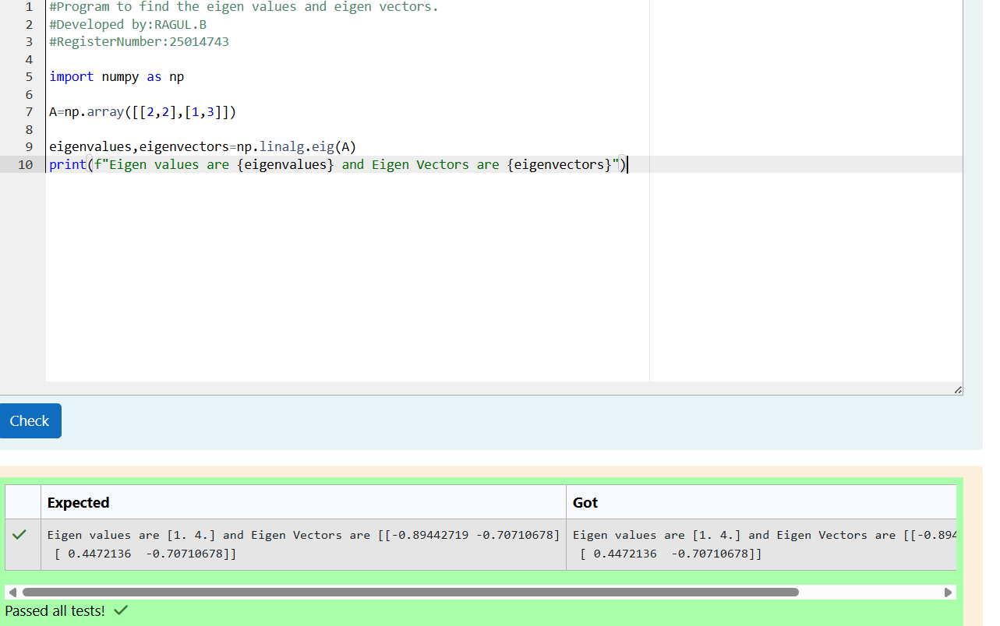

# EIGENVALUES-AND-EIGENVECTORS
## Aim:
To write a python program to find the Eigenvalues and Eigen Vectors
## Equipment’s required:
1. 	Hardware – PCs
2. 	Anaconda – Python 3.7 Installation / Moodle-Code Runner
## Algorithm:
### Step1 : 
Import the NumPy module to perform matrix and linear algebra operations.
### Step 2: 
Create the matrix by entering the elements in a list and converting it into a NumPy array using np.array().
### Step 3:
 Use the np.linalg.eig() function to compute the eigenvalues and eigenvectors of the matrix.
### Step 4: 
Display the eigenvalues and eigenvectors using the print() function.End of Program

## Output:

## Result:
Thus the Eigenvalue and Eigenvector is successfully solved using python program
